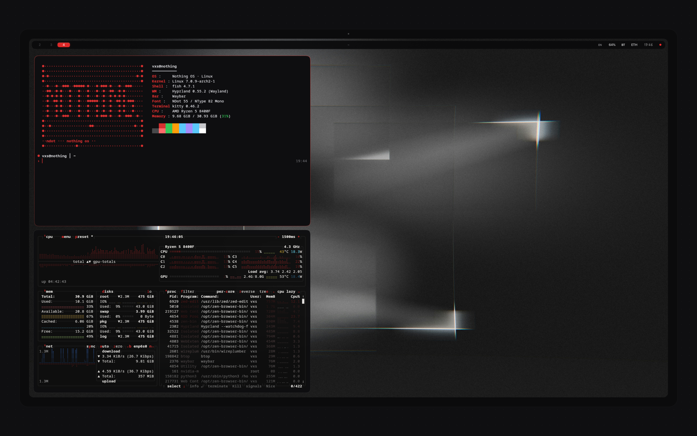
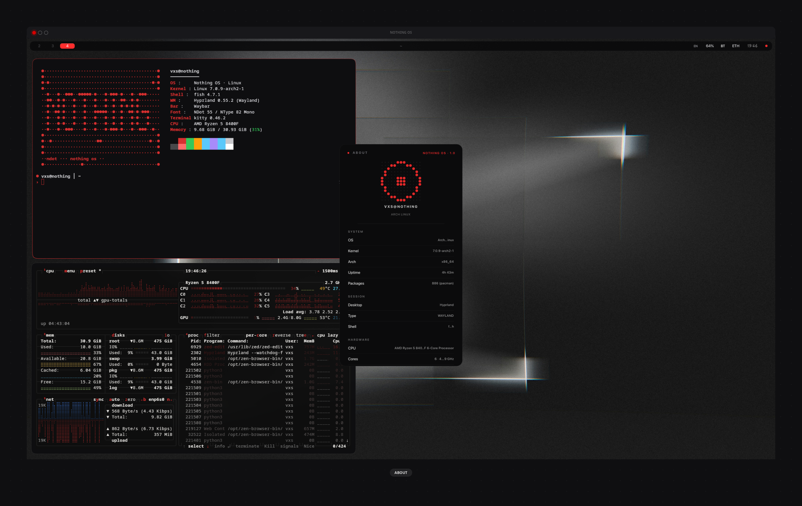
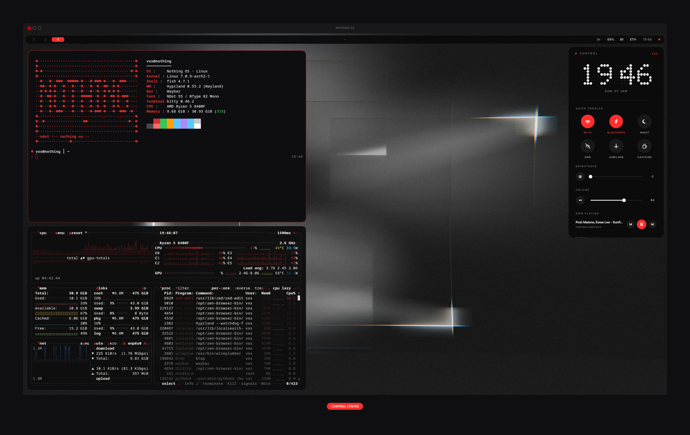
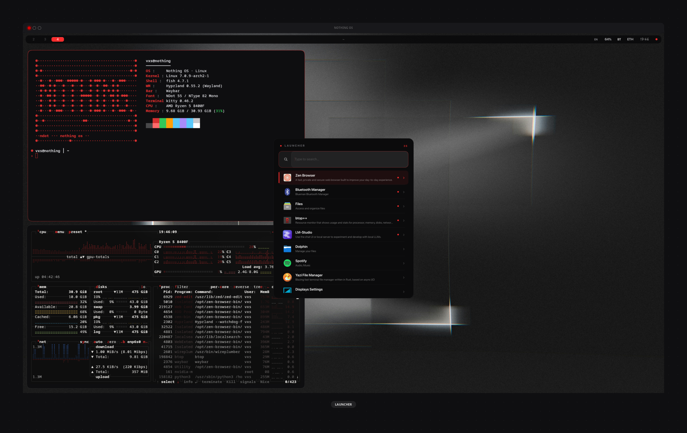
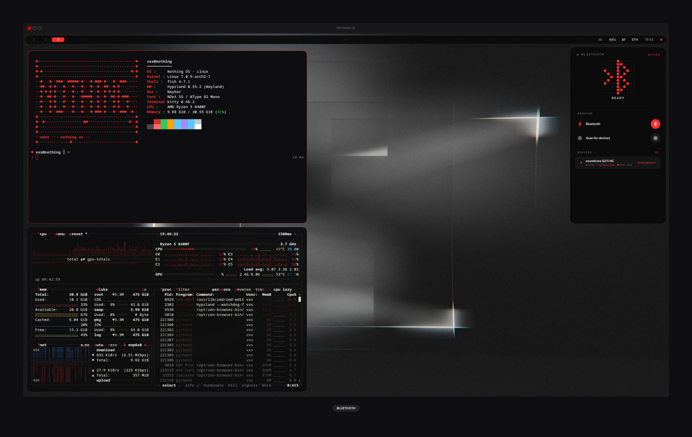
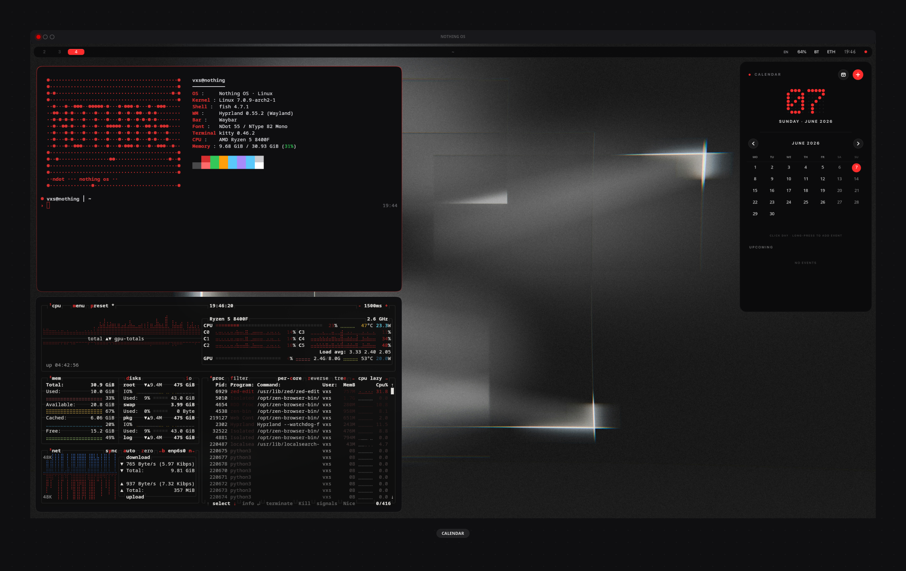
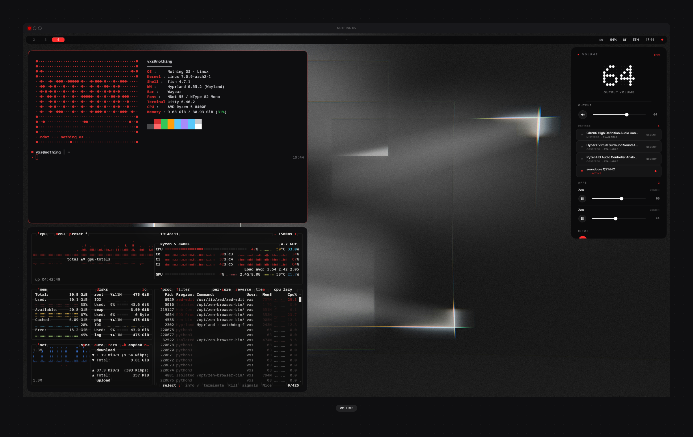

# nothing-os-desktop

<div align="center">

<!-- Hero banner image, 1280×640 — make in Figma later -->


# Nothing OS for Desktop

**An unofficial recreation of Nothing OS design language**
**built on Arch Linux + Hyprland**

[](https://hyprland.org)
[](https://archlinux.org)
[](LICENSE)
[](https://github.com/vxsetup/nothing-os-desktop/stargazers)

[Watch Demo](https://youtube.com/watch?v=PLACEHOLDER) · [Install](#install) · [Gallery](#gallery) · [Components](#components)

</div>

---

<!-- 5-10s killer GIF — use nothing-demo-record gif -->
<div align="center">

</div>

---

## Why this exists

I've been a Nothing fan since the Nothing phone 1. When Nothing OS 1.0 dropped, I wanted that same design language on my Linux workstation — pixel-perfect.

Eight months later, here it is.

This is a **love letter** to the Nothing team — not affiliated, not endorsed, just built out of admiration for your design philosophy.

---

## Features

- **● Authentic NDot dot-matrix font** rendered via Cairo in every UI element
- **● 12 desktop popups** matching Nothing OS Control Center / Quick Settings / etc
- **● Workspace switcher overlay** with proportional window thumbnails
- **● Custom waybar** — dot indicators, hero clock, mono technical labels
- **● Hyprlock** — dot-matrix lockscreen with side-tracked mono details
- **● Plymouth boot animation** — NDot logo + 12-dot progress
- **● Custom GTK 3/4 themes** — every legacy app inherits Nothing palette
- **● Premium animations** — spring easing on workspaces and windows
- **● Pure** `#141416` / `#F7F7F7` / `#FF2D2D` palette — no compromises

---

## Gallery

<table>
<tr>
<td width="50%"></td>
<td width="50%"></td>
</tr>
<tr>
<td><b>Desktop with about</b>/td>
<td><b>Control Center</b><br/>Hero NDot clock, circular toggles, minimal sliders</td>
</tr>
<tr>
<td></td>
<td></td>
</tr>
<tr>
<td><b>Launcher</b><br/>Fuzzy search, frequency tracking, flat list UI</td>
<td><b>Bluetooth</b><br/>Massive dot-matrix icon</td>
</tr>
<tr>
<td></td>
<td></td>
</tr>
<tr>
<td><b>Calendar</b><br/>Add events, monitoring date</td>
<td><b>Volume panel</b><br/>Per-app mixer, device picker, mic controls</td>
</tr>
</table>

More screens in docs/gallery

---

## Components

### Desktop popups
| Name | Description | Trigger |
|------|-------------|---------|
| `nothing-control` | Quick toggles, brightness, volume, media, power | Click `●` in waybar |
| `nothing-volume` | Full audio mixer (output/input/apps) | Click `70` in waybar |
| `nothing-network` | Wi-Fi picker, ethernet status | Click `WIFI` in waybar |
| `nothing-bluetooth` | BT scan, pair, connect with battery | Click `BT` in waybar |
| `nothing-notifications` | Notification center, history, DND | Click bell |
| `nothing-calendar` | Month grid, agenda, CRUD events | Click clock |
| `nothing-launcher` | App launcher with fuzzy search | `Super + Space` |
| `nothing-recorder` | Screen recorder (full/region/audio) | Click `●` in waybar |
| `nothing-screenshot` | Screenshot picker with delay/preview | `PrintScreen` |
| `nothing-osd` | On-screen volume/brightness display | Scroll waybar |
| `nothing-about` | System info panel | Settings → About |
| `nothing-workspaces` | Mission Control overlay | `Super + Tab` |

### System integration
- `waybar` — top bar with dot workspace indicators
- `hyprlock` — Nothing-style lockscreen
- `hypridle` — idle timeout management
- `plymouth-nothing-os` — boot splash
- `greetd + tuigreet` — login screen
- `gtk-3.0` / `gtk-4.0` themes — Nothing palette for all apps

---

## Install

> ⚠️ **Warning**: This is an opinionated, full-system setup. It expects Arch Linux + Hyprland. Read [INSTALL.md](INSTALL.md) before running.

### One-line install
```bash
curl -fsSL https://raw.githubusercontent.com/vxsetup/nothing-os-desktop/main/install.sh | bash
```

### Manual install
```bash
git clone https://github.com/vxsetup/nothing-os-desktop.git
cd nothing-os-desktop
./install.sh
```

### Dependencies
```bash
sudo pacman -S hyprland hyprlock hypridle waybar grim slurp wf-recorder \
               wl-clipboard pavucontrol brightnessctl playerctl \
               jq python python-gobject python-pycairo gtk4 gtk4-layer-shell \
               ttf-jetbrains-mono-nerd starship eza bat fastfetch \
               bluez bluez-utils networkmanager mako greetd greetd-tuigreet

# NDot font (manual download)
mkdir -p ~/.local/share/fonts
# Download Ndot 55, Ndot 57 from https://nothing.tech (or community fonts)
fc-cache -fv
```

---

## Customization

All popups, widgets, and theme files live under `~/.config/nothing-os/`. Edit any Python file — changes are live (no compile step).

### Change accent color
Edit `~/.local/lib/nothing-os/nothing_style.py`:
```python
TOKENS = {
    'accent': '#FF2D2D',   # change to your color
    ...
}
```

### Reposition widgets
Edit `~/.local/state/nothing-os/widgets.json`.

---

## Project status

This is a **personal project** — code reflects my taste and Arch+Hyprland setup. PRs welcome but **not actively maintained for other distros**.

### Tested on
- Arch Linux (rolling)
- Hyprland 0.55+
- Wayland session
- 1440p and 4K displays

### Known issues
- ❌ Not tested on Sway / River / other compositors
- ❌ AMD GPU specific issues with VAAPI hardware encoding (uses libx264 fallback)
- ⚠️ Plymouth theme requires manual mkinitcpio rebuild

---

## Credits

- **Nothing** — for the original design language ([nothing.tech](https://nothing.tech))
- **NDot font** — community port of Nothing's display typeface
- **Hyprland** — the compositor that made this possible
- **vaxerski** + Hyprland contributors

---

## License

[MIT](LICENSE) — do what you want, just don't claim affiliation with Nothing.

---

<div align="center">

<sub>Built with ❤️ for Nothing</sub>

<sub>Not affiliated with Nothing Technology Limited</sub>

</div>

